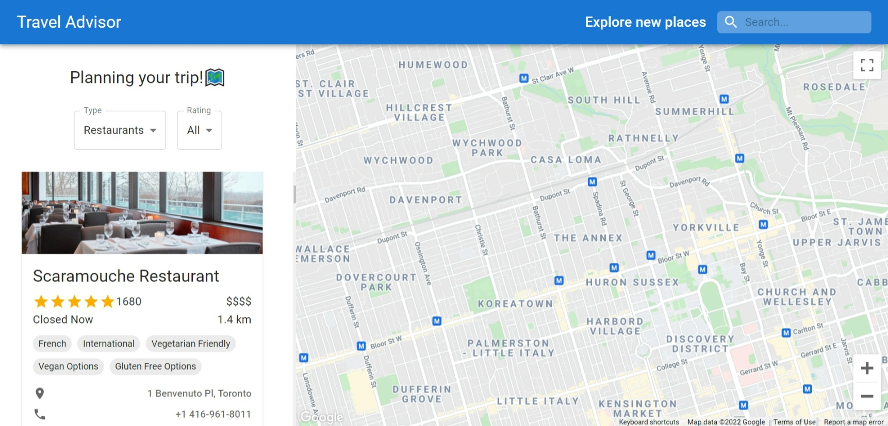

# Travel Advisor Website

## Table of contents

- [Overview](#overview)
  - [The challenge](#the-challenge)
  - [Screenshot](#screenshot)
  - [Links](#links)
- [My process](#my-process)
  - [Built with](#built-with)
  - [Continued development](#continued-development)

## Overview

### The challenge

Users should be able to:

- View the optimal layout for the site depending on their device's screen size
- Search and browse all nearby restaurans/hotels/attrctions on the google map. (In progress)
- "Like" this place. (In progress)
- Click "WEBSITE" button to link to their website to check details. (In progress)
- Check all reviews for this place. (In progress)

### Screenshot

### Links

<!-- - Solution URL: [Click Here]()
- Live Site URL: [Click Here]() -->

## My process

### Built with

- CSS custom properties
- Responsive web design
- [React](https://reactjs.org/) - JS library
- MUI - React UI library
- Rapid API - Travel Advisor
- React Google Map API
- axios
